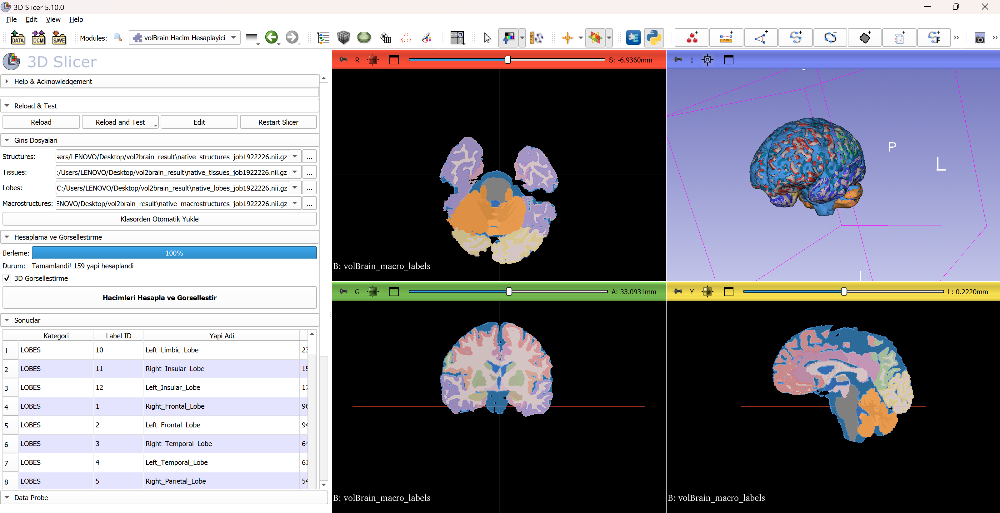
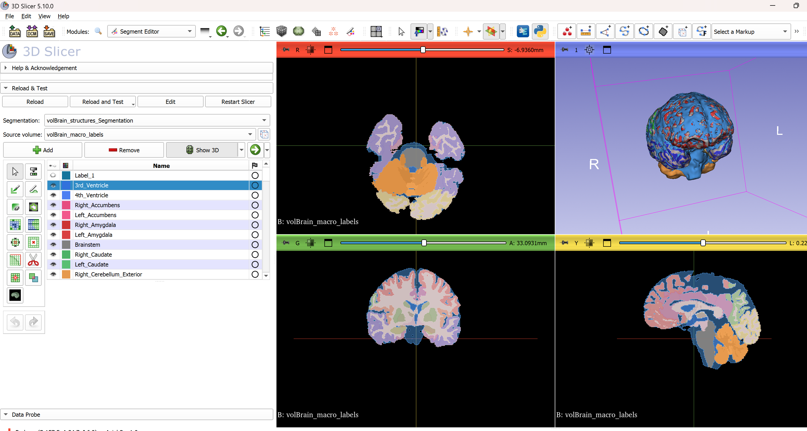

# SlicerVolBrain

[](https://www.slicer.org/)
[](LICENSE)

3D Slicer extension for comprehensive brain structure volume calculation and 3D visualization from volBrain segmentation outputs.



## Features

### 📊 Volume Analysis
- **Automatic volume calculation** for all brain structures from volBrain segmentations
- Support for **4 segmentation types**:
  - **Structures**: 108+ cortical regions + 28 subcortical structures
  - **Tissues**: GM, WM, CSF, and tissue subtypes (7 classes)
  - **Lobes**: 12 brain lobes (frontal, parietal, temporal, occipital, limbic, insular)
  - **Macrostructures**: cerebrum, cerebellum, brainstem
- Real-time calculation with progress tracking
- Results in both mm³ and mL

### 🎨 3D Visualization
- **Automatic 3D rendering** with anatomically accurate colors
- **Multi-select visibility control**: Show/hide specific structures
- **Interactive opacity slider**: Adjust transparency (0-100%)
- Color-coded by region:
  - 🔴 Frontal lobes → Red
  - 🔵 Temporal lobes → Blue
  - 🟢 Parietal lobes → Green
  - 🟡 Occipital lobes → Yellow
  - 🟣 Limbic structures → Purple
  - 🟠 Insula → Orange

### 📈 Export & Analysis
- **Excel export** (.xls format with HTML tables)
- **CSV export** for data analysis
- **Copy to clipboard** for quick pasting into documents
- Sortable results table with category grouping

## Installation

### Option 1: Extension Manager (Recommended)
1. Open 3D Slicer
2. Go to **View → Extension Manager**
3. Search for "**volbrain**"
4. Click **Install**
5. Restart Slicer

### Option 2: Manual Installation
1. Download this repository:
```bash
   git clone https://github.com/niyaziacer/SlicerVolBrain.git
```

2. In 3D Slicer:
   - Go to **Edit → Application Settings**
   - Select **Modules** tab
   - Click **Add** under "Additional module paths"
   - Select the `SlicerVolBrain/VolBrainVolumeCalculator` folder
   - Click **OK** and restart Slicer

3. Find the module:
   - **Modules → Quantification → volBrain Volume Calculator**

## Usage

### Quick Start

1. **Process your T1 image with volBrain**
   - Visit [volBrain.net](https://volbrain.net)
   - Upload your T1 MRI scan
   - Download the segmentation results

2. **Load files in Slicer**
   - Open the **volBrain Volume Calculator** module
   - Click **"Auto-Load from Folder"**
   - Select your volBrain results folder
   - All relevant files will be automatically detected

3. **Calculate volumes**
   - Enable **"3D Visualization"** checkbox (recommended)
   - Click **"Calculate Volumes and Visualize"**
   - Wait for processing (progress bar shows status)

4. **Explore results**
   - View volumes in the results table
   - Click structures in the list to show/hide in 3D
   - Adjust opacity with the slider
   - Export to Excel or CSV

### Detailed Workflow

#### Input Files
The module expects volBrain output files with these naming patterns:
- `native_structures_*.nii.gz` - Subcortical and cortical structures
- `native_tissues_*.nii.gz` - Tissue classification
- `native_lobes_*.nii.gz` - Brain lobes
- `native_macrostructures_*.nii.gz` - Major brain divisions

#### 3D Visualization Controls
- **Structure List**: Multi-select list (Ctrl+Click for multiple)
- **Show Selected Only**: Display only selected structures in 3D
- **Show All**: Make all structures visible
- **Hide All**: Hide all structures
- **Opacity Slider**: Adjust transparency (useful for seeing internal structures)

#### Export Options
- **📊 Excel**: Save as HTML table (.xls) - opens directly in Excel/LibreOffice
- **💾 CSV**: Export as comma-separated values
- **📋 Copy**: Copy table to clipboard for pasting into documents

## Label Specifications

This module follows the official volBrain label mapping:

### Structures (native_structures)
- **Labels 4, 11**: Ventricles (3rd, 4th)
- **Labels 23-62**: Subcortical structures (hippocampus, amygdala, thalamus, etc.)
- **Labels 71-76**: Cerebellum lobules and basal forebrain
- **Labels 100-207**: 108 cortical gyri (based on Neuromorphometrics atlas)

### Tissues (native_tissues)
1. CSF
2. Cortical Gray Matter
3. Cerebral White Matter
4. Subcortical Gray Matter
5. Cerebellar Gray Matter
6. Cerebellar White Matter
7. Brainstem

### Lobes (native_lobes)
1-2. Frontal (Right/Left)
3-4. Temporal (Right/Left)
5-6. Parietal (Right/Left)
7-8. Occipital (Right/Left)
9-10. Limbic (Right/Left)
11-12. Insular (Right/Left)

### Macrostructures (native_macrostructures)
1. Left Cerebrum
2. Right Cerebrum
3. Left Cerebellum
4. Right Cerebellum
5. Vermal
6. Brainstem

For complete label mapping, see the [volBrain documentation](https://volbrain.net).

## Requirements

- **3D Slicer**: Version 5.0 or later
- **Python packages**: NumPy (included in Slicer)
- **Input data**: volBrain segmentation results in NIfTI format (.nii or .nii.gz)

## Screenshots

### Main Interface


### 3D Visualization


## Citation

If you use this extension in your research, please cite:
```bibtex
@software{slicervolbrain2025,
  title={SlicerVolBrain: 3D Slicer Extension for volBrain Analysis},
  author={Acer, Niyazi},
  year={2025},
  url={https://github.com/niyaziacer/SlicerVolBrain}
}
```

And please cite volBrain:
```bibtex
@article{manjon2016volbrain,
  title={volBrain: An online MRI brain volumetry system},
  author={Manj{\'o}n, Jos{\'e} V and Coup{\'e}, Pierrick},
  journal={Frontiers in neuroinformatics},
  volume={10},
  pages={30},
  year={2016},
  publisher={Frontiers}
}
```

## Contributing

Contributions are welcome! Please feel free to submit a Pull Request.

1. Fork the repository
2. Create your feature branch (`git checkout -b feature/AmazingFeature`)
3. Commit your changes (`git commit -m 'Add some AmazingFeature'`)
4. Push to the branch (`git push origin feature/AmazingFeature`)
5. Open a Pull Request

## Support

- **Issues**: [GitHub Issues](https://github.com/niyaziacer/SlicerVolBrain/issues)
- **3D Slicer Forum**: [discourse.slicer.org](https://discourse.slicer.org)
- **volBrain Support**: [volbrain.net](https://volbrain.net)


## Developer

Prof. Dr. Niyazi Acer (Retired, Erciyes University)

## Acknowledgments

- [volBrain](https://volbrain.net) team for the brain segmentation pipeline
- [3D Slicer](https://www.slicer.org/) community
- Neuromorphometrics atlas for cortical parcellation

## Links

- **3D Slicer**: https://www.slicer.org/
- **volBrain**: https://volbrain.net/
- **Extension Catalog**: available in 3D Slicer's built-in Extension Manager (search "volbrain"), listed at [Slicer/ExtensionsIndex](https://github.com/Slicer/ExtensionsIndex/blob/main/volbrain.json)
- **Documentation**: this README (no separate wiki yet)
